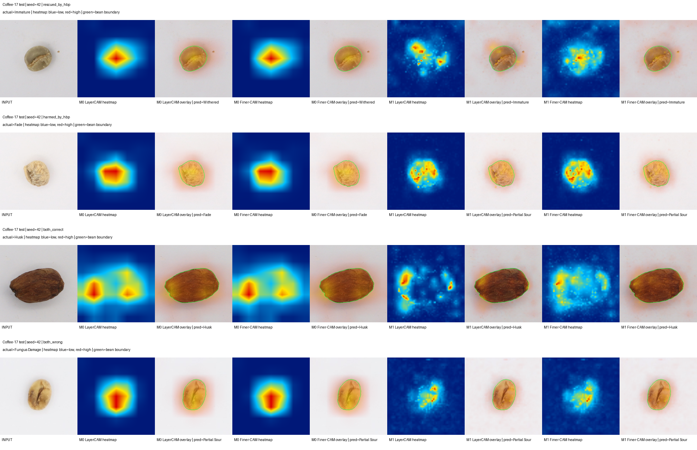

# Hasil final MobileNetV3-GAP vs MobileNetV3-HBP

Tanggal penguncian hasil: **16 Juli 2026**.

Dokumen ini adalah catatan hasil final untuk eksperimen source-only Coffee-17.
Hasil screening lama, OOF yang masih mengandung exact duplicate, eksperimen
domain sintetis, dan benchmark USK-Coffee tidak menggantikan angka test yang
dicatat di sini.

## Protokol yang dikunci

- Dataset: Coffee Green Bean with 17 Defects, versi content-clean.
- Split: `data/coffee17_hierarchy_clean/folds/fold_1`.
- Training memakai augmentasi online hanya pada train.
- Evaluasi final memakai split test yang tidak digunakan untuk tuning.
- Seed: 42, 123, dan 2026.
- M0: MobileNetV3-Large + GAP + CE.
- M1: MobileNetV3-Large + HBP + CE.
- Semua angka berikut adalah mean dan sample standard deviation tiga seed.

## Hasil test final

| Metrik | M0 GAP (%) | M1 HBP (%) | Delta berpasangan M1-M0 (poin) |
|---|---:|---:|---:|
| Accuracy | 85,26 ± 1,26 | **86,93 ± 3,14** | **+1,68 ± 4,33** |
| Balanced accuracy | 85,39 ± 1,40 | **86,63 ± 3,20** | **+1,24 ± 4,60** |
| Macro-F1 | 85,46 ± 1,31 | **86,78 ± 3,20** | **+1,32 ± 4,51** |
| Hard-class F1 | 81,52 ± 2,13 | **84,01 ± 4,58** | **+2,48 ± 6,55** |
| Worst-class F1 | 55,64 ± 2,60 | **63,27 ± 3,33** | **+7,64 ± 5,76** |

M1 mengungguli M0 pada mean seluruh metrik yang ditetapkan. Keuntungan terbesar
muncul pada Worst-class F1, sehingga bukti utama manfaat HBP adalah pengurangan
kegagalan ekstrem pada kelas lemah, bukan hanya kenaikan rata-rata.

Variabilitas M1 antarseed lebih tinggi daripada M0. Standard deviation delta
Macro-F1 dan Hard-class F1 juga lebih besar daripada mean deltanya. Dengan hanya
tiga seed, hasil ini tidak boleh ditulis sebagai bukti signifikansi statistik
atau klaim bahwa HBP menang pada setiap seed. Formulasi yang diizinkan adalah
"secara rata-rata pada tiga seed".

## Efisiensi batch-1

Benchmark dilakukan pada CUDA yang sama, input 224, batch 1, 20 warmup, dan
100 iterasi. Angka ini mengukur forward model saja, bukan pipeline conveyor
end-to-end.

| Metrik | M0 GAP | M1 HBP | Perubahan M1 |
|---|---:|---:|---:|
| Parameter | 2.988.289 | 3.562.305 | +574.016 (+19,2%) |
| Estimasi ukuran FP32 | 11,40 MB | 13,59 MB | +2,19 MB (+19,2%) |
| Latency batch-1 | 5,922 ms | 7,425 ms | +1,503 ms (+25,4%) |
| Throughput model teoretis | 168,9 gambar/detik | 134,7 gambar/detik | -20,3% |

Throughput tersebut tidak memasukkan akuisisi kamera, deteksi biji, crop,
preprocessing, transfer data, dan postprocessing. Karena itu angka 134,7
gambar/detik tidak boleh disebut sebagai FPS conveyor atau perangkat edge.

## Keputusan model

**M1 (MobileNetV3-Large + HBP + CE) dikunci sebagai model final Coffee-17.**

Biaya absolut HBP adalah sekitar 2,19 MB FP32 dan 1,50 ms per gambar pada GPU
pengujian. Trade-off ini diterima karena mean seluruh metrik meningkat dan
Worst-class F1 naik 7,64 poin. M0 tetap menjadi baseline serta opsi yang lebih
ringan dan lebih stabil terhadap seed.

Klaim ini khusus untuk protokol Coffee-17. Pada benchmark USK-Coffee empat
kelas yang terpisah, MobileNetV3-GAP memperoleh Macro-F1 validation 95,65%,
sedangkan MobileNetV3-HBP 94,77%. Hasil tersebut mencegah klaim bahwa HBP
universal; manfaatnya bergantung pada karakter fine-grained dataset.

## Dukungan dari reproduksi protokol paper

Sebagai eksperimen keterbandingan, P0/P1 mengikuti protokol Arwatchananukul et
al. sejauh informasi paper memungkinkan: enam rotasi dibuat sebelum split
70/20/10, backbone dibekukan, LR 0,01, dan training tiga epoch. Pada tiga seed,
P1 HBP mengungguli P0 GAP secara konsisten:

| Metrik test | P0 GAP (%) | P1 HBP (%) | Delta berpasangan (poin) | Seed membaik |
|---|---:|---:|---:|---:|
| Accuracy | 87,51 | **93,93** | **+6,41 ± 2,26** | 3/3 |
| Macro-F1 | 87,07 | **93,68** | **+6,61 ± 2,33** | 3/3 |
| Hard-class F1 | 83,42 | **91,00** | **+7,58 ± 2,59** | 3/3 |
| Worst-class F1 | 65,43 | **81,41** | **+15,98 ± 6,13** | 3/3 |

Temuan ini menguatkan arah hasil clean M0/M1: HBP terutama membantu kelas
terlemah. Besarnya gain paper-style tidak dijadikan bukti utama karena rotasi
sebelum split memungkinkan identity leakage. Protokol clean grouped di bagian
awal tetap menjadi estimasi generalisasi yang dipakai untuk keputusan model.
Detail asumsi dan batas klaim ada di `docs/PAPER_REPRODUCTION_PROTOCOL.md`.

## Ablasi SPPF-Attention

Ablasi validation faktorial menghasilkan:

| Model | Macro-F1 (%) | Hard-F1 (%) | Worst-F1 (%) |
|---|---:|---:|---:|
| M0: GAP | 88,55 | 81,34 | 64,32 |
| M1: HBP | **89,65** | 81,86 | 66,46 |
| S0: SPPF-Attention + GAP | 88,06 | 80,05 | **70,71** |
| S1: SPPF-Attention + HBP | 89,50 | **82,57** | **70,71** |

S1 tampak melindungi kelas terburuk pada validation, tetapi gagal pada test:

| Metrik test | M1 HBP (%) | S1 SPPF-HBP (%) | Delta S1-M1 (poin) |
|---|---:|---:|---:|
| Macro-F1 | **86,78** | 85,25 | -1,53 |
| Hard-F1 | **84,01** | 83,29 | -0,72 |
| Worst-F1 | **63,27** | 57,07 | -6,20 |

SPPF-Attention ditolak sebagai komponen model final. Hasil test tidak digunakan
untuk men-tuning ulang S1; S0, S1, dan capacity-matched C1 dipertahankan sebagai
ablasi negatif.

## Artefak pelaporan

Runner `python -m bilinear_lmmd.run_final_hbp_report` menghasilkan:

- `final_summary.json`: angka lengkap dan benchmark efisiensi;
- `per_seed.csv`: hasil serta delta berpasangan setiap seed;
- `per_class.csv`: mean F1 per kelas, delta, dan jumlah seed yang membaik;
- `FINAL_HBP_REPORT.md`: ringkasan siap baca.

Report per kelas dan confusion matrix harus tetap disertakan pada lampiran tesis;
angka agregat di dokumen ini tidak menggantikannya.

## XAI model final

Runner `python -m bilinear_lmmd.run_final_hbp_xai` membandingkan M0 dan M1 pada
sampel test yang dipilih deterministik dari empat outcome: `rescued_by_hbp`,
`harmed_by_hbp`, `both_correct`, dan `both_wrong`. Setiap panel memuat input,
raw LayerCAM heatmap, overlay LayerCAM, raw Finer-LayerCAM heatmap, dan overlay
Finer-LayerCAM untuk kedua model. Target penjelasan adalah kelas aktual.

XAI hanya dipakai setelah model dikunci. Heatmap tidak digunakan untuk memilih
checkpoint atau tuning. Interpretasi wajib menyandingkan visual dengan
foreground mass, background leakage, dan relative confidence drop; visual yang
menarik saja tidak membuktikan model memakai fitur secara kausal.

### Hasil XAI terpilih lintas seed

Analisis kuantitatif memakai 36 sampel test: tiga sampel per outcome pada
masing-masing seed 42, 123, dan 2026. Dengan demikian setiap outcome memiliki
sembilan sampel. Tabel berikut adalah mean delta M1-M0; nilai relative drop
positif berarti penghapusan region CAM M1 lebih merusak bukti kelas aktual
relatif terhadap kelas pembanding daripada penghapusan region CAM M0.

| Metode | Delta foreground mass | Delta background leakage | Delta relative confidence drop |
|---|---:|---:|---:|
| LayerCAM | -2,62 poin | +2,62 poin | +0,1381 |
| Finer-LayerCAM | -2,42 poin | +2,42 poin | +0,1345 |

Secara agregat, M1 tidak menghasilkan perhatian yang lebih terkonsentrasi pada
foreground. CAM M1 sedikit lebih menyebar dan memiliki background leakage lebih
tinggi. Namun region yang dipilih M1 lebih berpengaruh terhadap pemisahan kelas,
ditunjukkan oleh relative confidence drop yang positif pada kedua metode.

### Hasil per outcome

| Outcome (n=9 masing-masing) | Metode | Delta foreground | Delta leakage | Delta relative drop |
|---|---|---:|---:|---:|
| `rescued_by_hbp` | LayerCAM | -5,35 poin | +5,35 poin | +0,5458 |
| `rescued_by_hbp` | Finer-LayerCAM | -5,22 poin | +5,22 poin | +0,6174 |
| `harmed_by_hbp` | LayerCAM | +1,42 poin | -1,42 poin | -0,2295 |
| `harmed_by_hbp` | Finer-LayerCAM | +1,46 poin | -1,46 poin | -0,2764 |
| `both_correct` | LayerCAM | -2,04 poin | +2,04 poin | -0,0406 |
| `both_correct` | Finer-LayerCAM | -1,20 poin | +1,20 poin | -0,0820 |
| `both_wrong` | LayerCAM | -4,51 poin | +4,51 poin | +0,2767 |
| `both_wrong` | Finer-LayerCAM | -4,72 poin | +4,72 poin | +0,2789 |

Perbedaan paling jelas muncul antara sampel yang diselamatkan dan dirusak HBP.
Pada Finer-LayerCAM, pemisahan relative drop keduanya adalah 0,8938
(`+0,6174 - (-0,2764)`); pada LayerCAM nilainya 0,7753. Sebaliknya, foreground
mass lebih tinggi pada outcome `harmed_by_hbp` dan lebih rendah pada
`rescued_by_hbp`. Karena itu, konsentrasi perhatian di dalam biji saja bukan
indikator keberhasilan. Temuan diagnostik mendukung interpretasi bahwa HBP
membantu ketika fitur lokalnya menjadi lebih diskriminatif terhadap kelas
pesaing, bukan karena HBP sekadar melihat lebih banyak foreground.

Relative drop positif pada `both_wrong` hanya menunjukkan bahwa sebagian region
membawa bukti bagi kelas aktual; bukti itu tetap tidak cukup membuat kelas
aktual memperoleh logit tertinggi. Nilai tersebut bukan bukti bahwa prediksi
model benar.

Gallery berikut adalah contoh kualitatif seed 42 dengan satu sampel per outcome:

### Batas klaim XAI

- Sampel diseimbangkan 9/9/9/9 berdasarkan outcome dan tidak merepresentasikan
  prevalensi alami outcome pada seluruh test.
- Target CAM adalah kelas aktual, termasuk ketika model salah. CAM pada error
  menjelaskan bukti untuk label benar, bukan secara langsung alasan model
  memilih label prediksinya.
- M0 menjelaskan satu feature map terdalam, sedangkan M1 menggabungkan tiga
  kedalaman yang dipakai HBP. Perbedaan granularitas spasial karena itu sebagian
  melekat pada desain model; sharpness heatmap tidak boleh dipakai sendirian
  sebagai bukti superioritas.
- Deletion metric lebih dekat ke uji faithfulness daripada inspeksi visual,
  tetapi tetap merupakan perturbasi post-hoc dan bukan bukti kausal.
